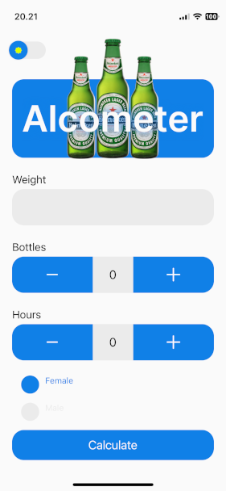
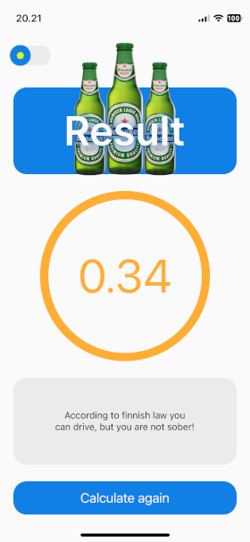
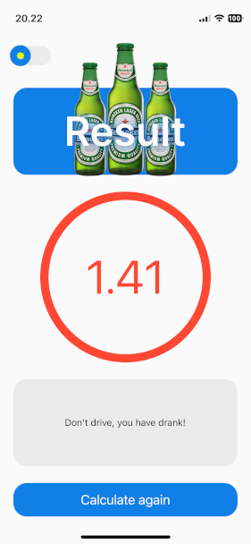

# Alcometer-react-native
This is an alcometer application that uses simple mathematical formula to calculate
user's blood alcohol level based on weight, number of beers, hours and gender. 

### Prerequisites

Before you begin, make sure you have the following software installed on your machine:

- [Node.js](https://nodejs.org/)
- [Expo CLI](https://docs.expo.dev/get-started/installation/)

### Getting started

After you have cloned this repo:

1. Install project dependencies
    - npm install
2. To run the project
    - npm start
  
### Screenshots

<table>
  <tr>
    <td></td>
    <td></td>
    <td></td>
  </tr>
</table>